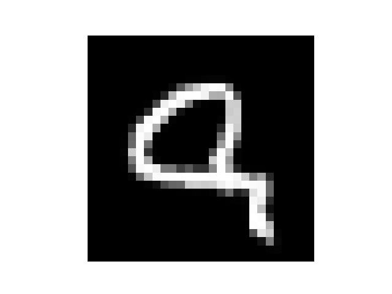

# Experiment 1: Raw Coordinate Mapping
## Core Hypothesis
The goal of this experiment is to see if a standard Multi-Layer Perceptron (MLP) could be configured to learn continuous representations of an image using only raw spatial coordinates $(x, y)$ as input.

---
## Hyperparameters
- **Input dimensions**: Normalised $(x, y)$ coordinates, so input shape is $(B, 2)$ where $B$ is the *batch size*, in this case, the total number of pixels in the image
- **Output dimension**: 1, this indicates the shade intensity of the pixel and remains within $[0, 1]$
- **Optimisation engine**: Adam optimiser with a learning rate of `0.001`
- **Training duration**: 1,000 epochs
- **Target dataset**: Randomly chosen MNIST digit ($28 \times 28$ grayscale image)

---
## Approaches
During testing, to save time 100 epochs were used when figuring out an optimal structure.

### Normalisation
The input $(x, y)$ was at first normalised within $[0, 1]$, but after comparing results with $[-1, 1]$ normalisation, it was changed.

This was likely due to the range of values. The difference between adjacent coordinates is smaller in $[0, 1]$ than in $[-1, 1]$ normalisation, as (in MNIST) $[0, 1]$ requires a division by $28$, while $[-1, 1]$ requires a diviosn by $14$.

To further help with the precision problem for the coordinates, the model runs on **fp64**.

### Loss Function
Instead of blindly using *Cross Entropy*, use a loss function more suitable for the data. The goal is to react a specific shade value, rather than classify something, no *Softmax* is used.

Immediately, *MSE Loss* (*L2*) comes to mind. However a major flaw is the **squared** operation which causes higher importance given to larger errors, small errors have negligible loss and don't get corrected, this creates oversmoothing.

*L1 Loss* fixes this by using *MAE*, however now the loss is too high. The same importance is given to a small error, which equally can be a problem as not every error should be treated the same, so borders might become too sharp.

*Huber Loss* fixes everything by blending *MSE* and *L1* together. Now, priority is still given to large errors, but the small errors not negligible.

### Architecture
Usually, all layers in the hidden layers would use *ReLU*, as it is geometrically powerful. However, this could bias positive coordinates from normalisation, so to fix this *LeakyReLU* was used.

Additionally, the final activation would also matter, the choise is between *Sigmoid* and *Tanh*.

Initially, *Tanh* would seem to be the best option with a full *ReLU* activation network, this is also good for training as *Tanh* has a steep gradient at $0$.

Surprisingly, *Sigmoid* ended up being better. Instead of using *ReLU* everywhere in the hidden layers, a hybrid model was used where layers in the first half were *ReLU* and in the second half *LeakyReLU*. Upon further testing though, a full *LeakyReLU* ended up being better.

Additionally, to help with training and access, *Sigmoid* was also transformed: $Sigmoid(4x - 2)$. The multiplication by $4$ creates a steeper gradient at $0$, while the $- 2$ helps with moving the range towards the positive side, as *LeakyReLU* still biases the positive. The translation also helps with the initialisation, as it is likely better than initialising the final layer's biases to be negative.

Two models actually showed promising results:
- **Activation**: full *ReLU*
- **Final activation**: *Tanh*
- **Layer initialisation**: everything using *Xavier*

The other one was:
- **Activation**: hybrid of *LeakyReLU* with a slope of `0.1` and *ReLU*
- **Final activation** Regular *Sigmoid* works well enough
- **Hidden layer initialisation**: weights *He* initialised fitted for respective activation, while bias *0* initialised
- **Final layer initialisation**: weights by *Xavier* and bias *0* initialisation

This type of model is prone to gradient vanishing, however in the second model it looks like having more *ReLU* helps

---
## Results
Throughout testing, resulting images ranged between completely black screens from vanishing gradients to a cluster of white pixels in the middle. Occasionally there was smudging, however the image was actually successfully returned after 1,000 epochs and some luck with vanishing gradients:

**PSRN: 41 dB
MSE: 0.00008**

An interesting phenomenon can be observed, **spectral bias**. This can be seen in the following:

Overall, it is possible, but the size of the network required isn't worth it, and vanishing gradients are a major problem.