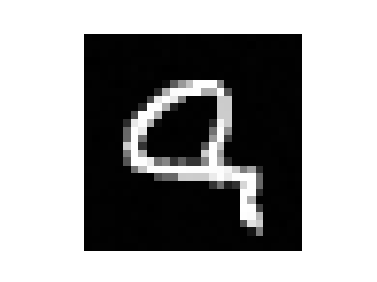
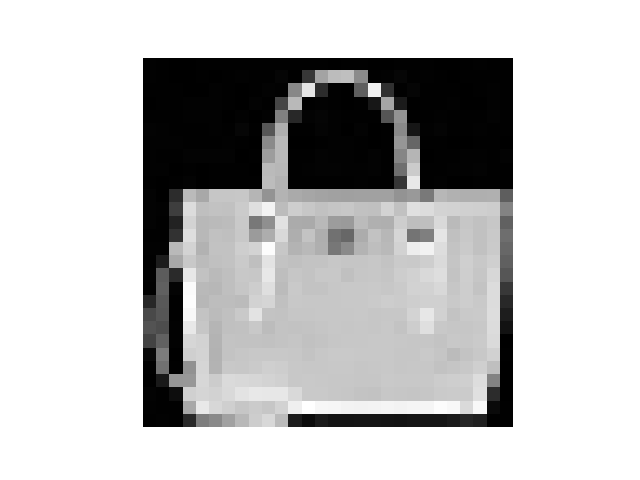

# Experiment 2: Using SIREN
## Core Hypothesis
The goal of this experiment is to see how SIREN manages to improve from a simple, naive implementation.

---
## Hyperparameters
- **Input dimension**: Normalised $(x, y)$ coordinates within $[-1, 1]$, so input is of shape $(B, 2)$ where $B$ is *batch size*
- **Output dimension**: For MNIST will be a single constant value indicating shade intensity of the pixel, but later it this is used for RGB images so 3 channels are used
- **Optimisation engine**: Adam optimiser with a learning rate of `0.0002`
- **Training duration**: 500 epochs for PNG, 100 for MNIST
- **Target dataset**: MNIST (using same image as in `experiment_1.md`), additional Fashion-MNIST image which both are $28 \times 28$, and an ImageNet JPG which is $750 \times 500$

---
## Approach
### MNIST & Fashion-MNIST
#### Architecture
1. Input layer, linear $(2, 128)$, first SIREN initialised with *sin* activation of $\omega_0=30$
2. 3 hidden layers, linear $(128, 128)$, SIREN initialised with *sin* activation of $\omega_0=30$
3. Output layer, linear $(256, 1)$, weight Xavier initialised and bias 0 initialised, no activation
- **Loss function**: Huber loss
- **Training cycles**: 100 epochs

### ImageNet
The JPG was $750 \times 500$ large. This is where CPU stops being enough, a CUDA core was used, as well as batching to not run out of memory.

The data had to be shuffled before each batching so that the positions could be evenly learnt, otherwise it would create a smudged wavy repeating image.

#### Architecture
1. Input layer, linear $(2, 256)$, first SIREN initialised with *sin* activation of $\omega_0=60$
2. 5 hidden layers, linear $(256, 256)$, SIREN initialsied with *sin* activation of $\omega_0=30$
3. Output layer, linear $(256, 3)$, weight Xavier initialised and bias 0 initialised, no activation
- **Loss function**: MSE loss
- **Trainig cycles**: 500 epochs

---
## Results
This model was extremely successful on MNIST images

**PSRN: 54.3 dB
MSE: 0.0000037**

**PSRN: 53.2 dB
MSE: 0.0000047**

If the dataset is not permuted before batching, it results in this smudging

Ultimately, it was successful for $750 \times 500$ JPG as well

**PSRN: 20.2 dB
MSE: 0.009**

Overall, SIREN is extremely powerful and successful as an Implicit Neural Representation (INR). It showed to be a significant upgrade, although it is also quite a sensitive model.