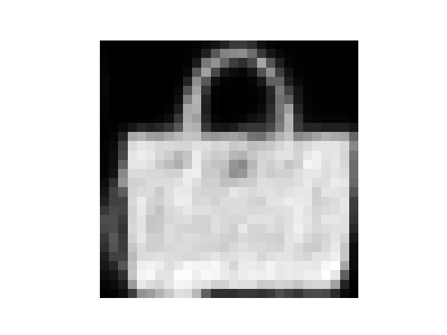
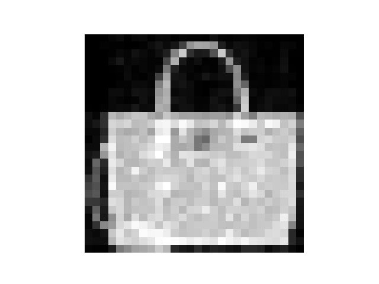
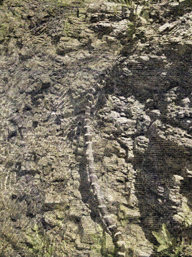

# Experiment 3: Using Fourier Networks
## Core Hypothesis
The goal is to look at networks using Fourier encodings, comparing NeRF against guassian distributed weights.

---
# Architecture & Hyperparameters
- **Input dimension**: Normalised $(x, y)$ coordinates within $[-1, 1]$, so input is of shape $(B, 2)$ where $B$ is *batch size*
- **Output dimension**: For MNIST will be a single constant value indicating shade intensity of the pixel, but later it this is used for RGB images so 3 channels are used
- **Optimisation engine**: Adam optimiser with a learning rate of `0.0002`
- **Target dataset**: Fashion-MNIST (using same image as in `experiment_2.md`) which is $28 \times 28$ in size, and an ImageNet JPG which is $375 \times 500$
- **Structure**: Deterministic and constant encoding layer, followed by a learnt model

---
## Approach
A fourier encoder calculates a *sin* and a *cos* vector, concatenating them into a fourier vector. They are calculated the same way as $sin(\vec{F_x} x + \vec{F_y} + y)$. $x$ and $y$ values multiply $\vec{F_x}$ and $\vec{F_y}$ frequency vectors, these vectors are the same for *sin* and *cos*.

For a guassian fourier encoder, we choose frequencies with $F_i \sim M \mathcal{N}(0,1^2)$, where $M$ is a multiplier controlling the maximum frequency. Additionally, to keep the frequencies consistent a set *seed* is used, this also means that the frequencies themselves don't need to be stored as they can be retrieved with a single value. This is powerful as it gives many frequencies, however it is localised so getting exceptionally low frequencies when on high frequencies is rare.

For a NeRF encoder, requencies are chosen as $\vec{F} = \begin{bmatrix} 2^0 \\ 2^1 \\ 2^2 \\ ... \\ 2^k \end{bmatrix}$ for $k$ many frequencies. Here, $\vec{F_x} = \vec{F_y} = \vec{F}$. This is really powerful as it gives a range of both low and high frequencies, however high frequencies are far apart.

### Fashion-MNIST
#### Architecture
1. Fourier Encoder into a 16-dimensional vector
2. Input layer, linear $(16, 128)$ with *ReLU* activation
3. Hidden layer, linear $(128, 128)$ with *ReLU* activation
4. Output layer, linear $(128, 1)$, with *Transformed Sigmoid* activation $sigmoid(4x-2)$, as mentioned in `experiment_1.md`
- **Loss function**: Huber loss
- **Training cycles**: 500 epochs
- **Multiplier**: 1 (for guassian fourier encoder)

### ImageNet
#### Architecture
1. Fourier Encoder into 24-dimensional vector
2. Input layer, linear $(24, 256)$ with *ReLU* activation
3. 3 Hidden layers, linear $(256, 256)$ with *ReLU* activation
4. Output layer, linear $(256, 3)$ with *Transformed Sigmoid* activation, this time without translation $sigmoid(4x)$ just to steepen its gradient
- **Loss function**: MSE loss
- **Training cycles**: 2,000 epochs
- **Multiplier**:  (for guassian fourier encoder)

---
## Results

**PSRN: 21.3 dB
MSE: 0.007**

**PSRN: 24.9 dB
MSE: 0.003**

**PSRN: 20 dB
MSE: 0.001**

**PSRN: 17.7 dB
MSE: 0.017**

Overall, it seems that NeRF was a better encoding solution compared to a guassian distribution. Despite the lower loss on the ImageNet solution, by comparing the images themselves it is clear that guassian has lost most colour compared to NeRF (clear when seeing the green plant on the bottom right). This might be a multiplier issue, but 30 was the one which gave the lowest loss.