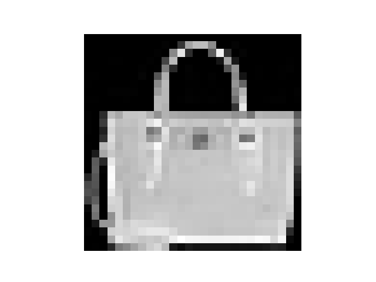
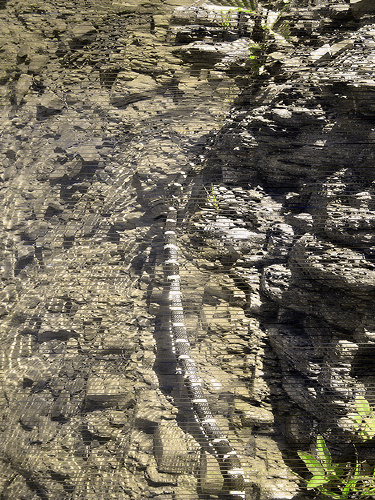

# Experiment 4: Using HashGrids for an NGP
## Core Hypothesis
The goal is to successfully make a HashGrid Encoder and implementing it, seeing how it compares with every previous model tested

---
## Architecture & Hyperparameters
- **Input dimension**: Normalised $(x, y)$ coordinates within $[0, 1]$, so input is of shape $(B, 2)$ where $B$ is *batch size*
- **Output dimension**: For MNIST will be a single constant value indicating shade intensity of the pixel, but later it this is used for RGB images so 3 channels are used
- **Optimisation engine**: Adam optimiser with a learning rate of `0.01`
- **Target dataset**: Fashion-MNIST which is $28 \times 28$ in size, and an ImageNet JPG which is $375 \times 500$
- **Structure**: Deterministic and constant encoding layer, followed by a learnt model with one hidden layer
- **Loss function**: Huber loss

---
## Approach
To test the model, first it was tested on Fashion-MNIST. It is also noted that normalisation this time is $[0, 1]$ as that's how th HashGrid handles coordinates.
### Architecture
1. HashGrid encoding of 6 layers and an embedding dimension of 2 (*16 min*, *28 max*)
2. Input layer, linear $(12, 64)$ with *ReLU* activation
3. Hidden layer, linear $(64, 64)$ with *ReLU* activation
4. Output layer, linear $(64, 1)$ without activation
- **Training cycles**: 500 epochs

### HashGrid Test Result
This was very successful, showing that this structure is really powerful

**PSRN: 84.1 dB
MSE: 0.000000004**

Next was using this on an ImageNet JPG, which is sized $375 \times 500$, as well as having 3 pixel components (RGB) rather than 1.

### ImageNet
Unlike other times, Huber loss gave better results than MSE, hence Huber will be used now.

Additionally, instead of permuting batches each epoch like in `experiment_3.md` and `experiment_2.md`, it is permuted once and batched, remaining consistent between epochs.

### Architecture
1. HashGrid encoding for 12 layers and an embedding dimension of 2 (*16 min*, *512 max*)
2. Input layer, linear $(24, 128)$ with *ReLU* activation
3. Hidden layer, linear $(128, 128)$ with *ReLU* activation
4. Output layer, linear $(128, 3)$ without activation
- **Training cycles**: 2,500 epochs

---
## Results
This was very successful, giving the best image out of all models tested so far.

**PSRN: 20.8 dB
MSE: 0.008**

Overall, using the Hash Grid proved to be really powerful, with only 1 narrow hidden layer needed and still producing a more accurate image compared to other methods. Both when looking at loss, but also looking at the image itself, seeing how there is significantly less colour loss.